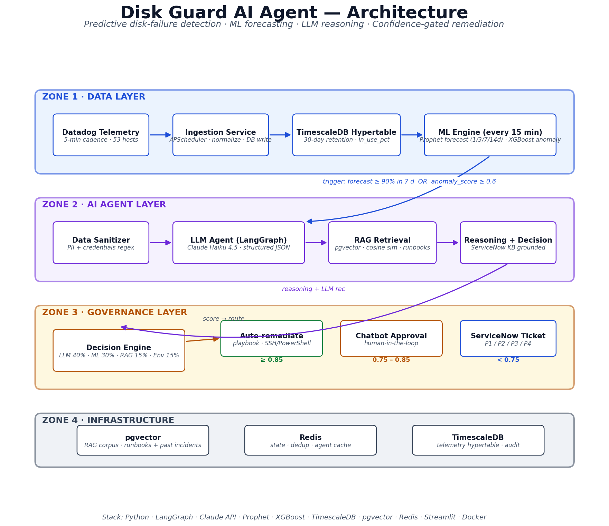

# OpsGPT Disk Prediction POC

Implementation of the OpsGPT reference architecture: predictive disk-fill
detection across ~3000 servers using ML, with LLM-driven reasoning and
governance-gated auto-remediation. Built for the InnoVista 2026 demo.

## Architecture



Regenerate with `python scripts/generate_architecture_diagram.py`.

## Status — Demo-ready

| Component | Status |
|---|---|
| Docker Compose stack (TimescaleDB + pgvector + Redis + 3 demo hosts) | ✅ |
| Synthetic Datadog generator + 3 self-reporting demo containers | ✅ |
| ML Engine (Prophet + XGBoost) | ✅ |
| RAG corpus + Data Sanitizer | ✅ |
| LangGraph agent + Decision Engine + Remediation Engine | ✅ |
| **ServiceNow mock + auto-ticket creation** | ✅ |
| **Streamlit UI (5 pages: Fleet, Host Detail, OpsGPT chat, Audit, Tickets)** | ✅ |
| **Demo reset script + walkthrough** | ✅ |

See [`DEMO_SCRIPT.md`](DEMO_SCRIPT.md) for the live walkthrough script.

### Streamlit UI

```bash
streamlit run ui/home.py
# → http://localhost:8501
```

Four pages:

| Page | What it shows |
|---|---|
| 🛰️ **Fleet Overview** (`home.py`) | Fleet metrics, anomaly-vs-forecast scatter, demo container cards, full sortable host table |
| 🖥️ **Host Detail** (`pages/1_🖥️_Host_Detail.py`) | Time-series chart, latest ML prediction, three demo buttons (Fill Disk / Run ML / Run LLM Reasoning), agent reasoning panel |
| 🤖 **OpsGPT** (`pages/2_🤖_OpsGPT.py`) | Chatbot interface for medium-confidence approvals — talk to the agent about its recommendation, then Approve (triggers remediation or files a ticket depending on the original LLM recommendation) or Deny |
| 📋 **Audit Trail** (`pages/3_📋_Audit_Trail.py`) | Every agent run with full LLM reasoning, tool calls, decision rationale, RAG document IDs |
| 📨 **Tickets** (`pages/4_📨_Tickets.py`) | ServiceNow mock — every auto-created ticket, filterable by status/severity/host, status lifecycle inline |

The "Fill Disk" button on Host Detail writes real files into the container
via docker-exec and optionally inserts backdated samples so the ML cycle
responds immediately. Click Run ML, then Run LLM Reasoning to walk through
the full ingestion → prediction → reasoning → decision → remediation cycle live.

### The hybrid fleet

The demo runs against **53 total hosts**:

- **3 real Linux containers** (`demo-web-01`, `demo-app-01`, `demo-db-01`) — each
  with its own filesystem and a self-reporting telemetry agent. The LLM agent
  and remediation engine operate on these via `docker exec`. This is where
  the live demo action happens — clicking "Fill disk" writes real files,
  clicking "Run ML" reads real telemetry, clicking "Run LLM Reasoning"
  invokes the agent against a real machine.
- **50 simulated hosts** — pure time-series in TimescaleDB. These exist to
  demonstrate fleet-scale ML (the architecture's "3000 servers" claim) — the
  fleet view shows them alongside the real ones so the demo conveys both
  story-level depth and operational scale.

### Verified end-to-end demo flow

```bash
# 1. fleet seeded (50 simulated + 3 real hosts pre-seeded with 7d history)
opsgpt-generate-data --hosts 50 --days 7
python data/seed_demo_hosts.py --days 7

# 2. RAG corpus + ML training (one-time)
python data/seed_runbooks.py
python -m services.ml_engine --train      # 30s, 500-host ephemeral training
python -m services.ml_engine --once       # 8s, 53-host scoring

# 3. live demo: anomaly path
python data/fill_disk.py demo-app-01 fill --gb 60 --with-backfill 60
python -m services.ml_engine --once
python -m services.llm_agent --host demo-app-01
# → LLM cites past incident INC-2024-0817, recommends escalate_anomaly
# → Decision Engine: auto_remediate route, but execution skipped
# → Verdict: escalated_anomaly (would create ServiceNow ticket in Day 5)

# 4. live demo: clean path
python data/fill_disk.py demo-web-01 fill --gb 25 --with-backfill 60   # baseline
# add some old archives that are safe to clean
docker exec demo-web-01 sh -c 'fallocate -l 4G /var/log/access.log.30.gz && touch -d "30 days ago" /var/log/access.log.30.gz'
python -m services.ml_engine --once
python -m services.llm_agent --host demo-web-01
# → LLM identifies safe rotated archives, recommends clean
# → Decision Engine: auto_remediate (confidence > 0.85)
# → Remediation Engine: actually deletes the archives
# → Verdict: cleaned, GBs freed
```

## Quickstart (Mac / Apple Silicon)

```bash
# 1. Container runtime
brew install --cask orbstack && open -a OrbStack

# 2. Python 3.12 + native deps
brew install python@3.12 libomp

# 3. Repo setup
git clone <repo-url> && cd opsgpt-disk-prediction-poc
cp .env.example .env                              # add ANTHROPIC_API_KEY
python3.12 -m venv .venv && source .venv/bin/activate
pip install -e ".[dev]"                           # ~5 min: prophet compiles Stan models

# 4. Boot Zone 1 + Zone 4
docker compose up -d

# 5. Seed + train + run ML cycle (Day 1 + Day 2)
PYTHONPATH=. python data/synthetic_generator.py --hosts 50 --days 7 --interval-min 5
PYTHONPATH=. python -m services.ml_engine --train      # ~30s, 500-host ephemeral set
PYTHONPATH=. python -m services.ml_engine --once       # ~8s, scores live fleet

# 6. Inspect
docker exec opsgpt_timescaledb psql -U opsgpt -d opsgpt_telemetry -c \
  "SELECT triggered_agent, COUNT(*) FROM ml_predictions GROUP BY triggered_agent;"

# 7. Tests (no Docker needed)
pytest
```

## The synthetic dataset

3000 hosts deterministically distributed across:

- **OS:** ~55% Windows, ~45% Linux
- **Environment:** ~60% prod, ~25% staging, ~15% dev
- **Region:** 5 AWS regions
- **Role:** 8 roles (web, app, db, batch, cache, queue, ml-worker, build-agent)
- **Disk size:** 100–2000 GB depending on role

And four behavioral patterns (deterministic per host_id):

| Pattern | Share | What it does | Where it shows up later |
|---|---|---|---|
| `stable` | 70% | Steady ~20–60% with mild noise + diurnal drift | ML noop, no agent invocation |
| `declining` | 15% | Slow drift toward fill at 0.5–2 GB/day | Prophet forecasts threshold breach → predictive cleanup |
| `anomalous` | 10% | Stable then 20–40% jump in last ~20% of window | XGBoost flags anomaly → agent escalates instead of cleaning |
| `critical` | 5% | Already > 90% used | Reactive cleanup triggers immediately |

All four patterns must be exercisable from the demo UI — the "Fill disk"
button (Day 4) will artificially flip a host into `anomalous` or `critical`
mid-demo so judges can watch the ML → LLM → decision flow live.

## Repo layout

```
opsgpt-disk-prediction-poc/
├── docker-compose.yml             # Zone 1 + Zone 4 + 3 demo hosts
├── docker/
│   ├── timescaledb/init.sql       # telemetry, predictions, agent_runs schemas
│   ├── pgvector/init.sql          # knowledge_docs schema (RAG corpus)
│   └── demo-host/                 # tiny Linux container = one production server
│       ├── Dockerfile
│       └── agent.py               # in-process telemetry agent (PID 1)
├── data/
│   ├── synthetic_generator.py     # 50 simulated fleet hosts
│   ├── seed_demo_hosts.py         # 7d history + disk-alignment for the 3 real hosts
│   └── fill_disk.py               # demo "Fill disk" helper (file write + DB backfill)
├── shared/                        # config, db, schemas, logging_setup
├── services/
│   ├── ingestion/                 # APScheduler + DB writer (Zone 1)
│   ├── ml_engine/                 # Prophet + XGBoost (Zone 1)
│   ├── llm_agent/                 # Claude + LangGraph + RAG (Zone 2)
│   ├── decision_engine/           # confidence scoring + routing (Zone 3)
│   ├── remediation/               # per-role playbooks + safe executor (Zone 3)
│   └── servicenow_mock/           # auto-ticketing (Zone 3)
├── ui/
│   ├── home.py                    # Fleet Overview (entry)
│   ├── pages/
│   │   ├── 1_🖥️_Host_Detail.py
│   │   ├── 2_🤖_OpsGPT.py        # OpsGPT chatbot for human-in-the-loop approvals
│   │   ├── 3_📋_Audit_Trail.py
│   │   └── 4_📨_Tickets.py
│   └── lib/                       # cached data layer + actions + styles
├── scripts/
│   ├── demo_reset.sh              # fresh-demo reset (preserves seed)
│   └── install_windows_task.ps1   # Windows production install (legacy ref)
├── ml_artifacts/                  # saved models (gitignored)
└── tests/                         # 39 tests; most run without Docker or LLM
```

## Configuration

Everything lives in `.env`. Defaults in `.env.example` are sane for local dev.
Notable knobs:

- `OPSGPT_LLM_MODEL` — defaults to `claude-haiku-4-5` (fast, cheap, good
  enough for this scope). Switch to `claude-sonnet-4-6` or `claude-opus-4-7`
  for richer reasoning at higher cost.
- `ML_TRIGGER_FILL_PCT=90` and `ML_TRIGGER_HORIZON_DAYS=7` — match the
  diagram's "ML predicts >90% fill in 7 days" trigger.
- `DECISION_AUTO_REMEDIATE_THRESHOLD=0.85` and `DECISION_OPSGPT_CHAT_THRESHOLD=0.75` —
  confidence-score gates exactly as drawn.

## License

Apache-2.0. See [LICENSE](LICENSE).
