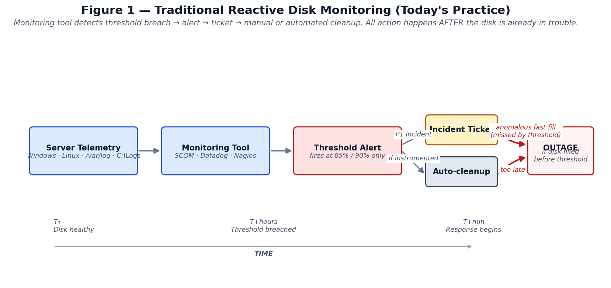
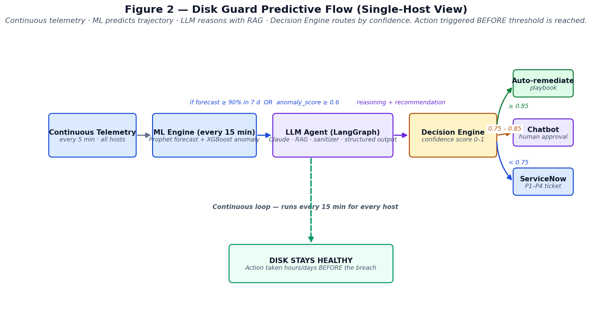
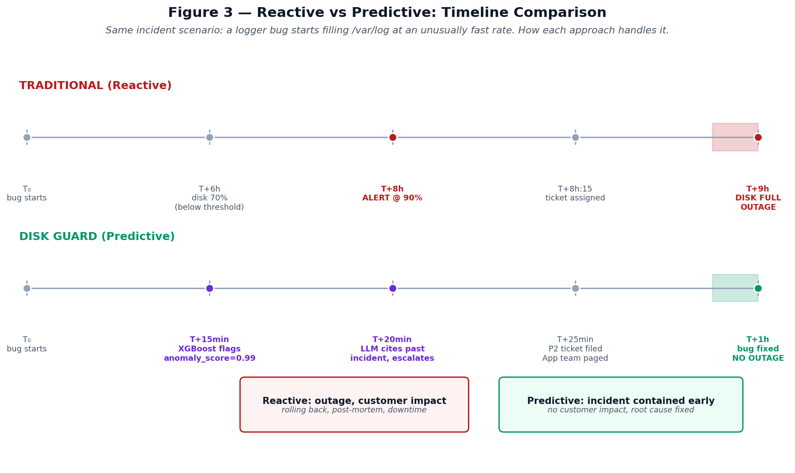
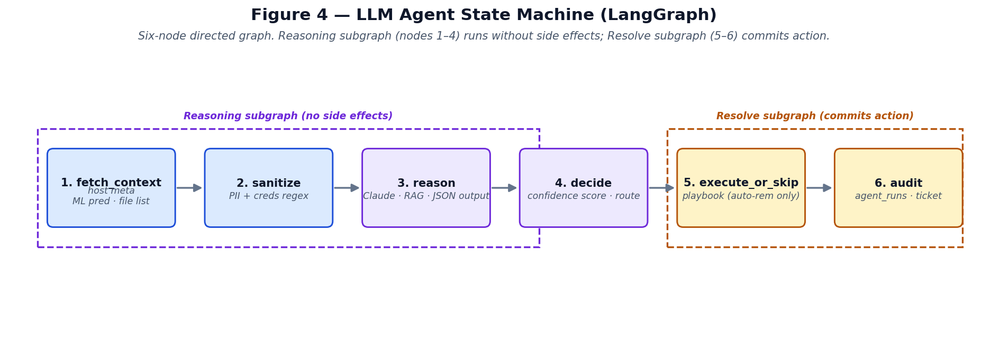

# Disk Guard AI Agent
### A Predictive Multi-AI Architecture for Proactive Disk-Failure Prevention in Production Server Fleets

**Author:** Naga (TCS)
**Version:** 1.0
**Date:** May 2026
**Status:** Working Proof-of-Concept (POC)
**Repository:** https://github.com/rajupitchuka/disk-guard-AIagent

---

## Abstract

Disk-fill incidents remain one of the most frequent and disruptive classes
of production failures across enterprise server fleets. Traditional
monitoring tools — SCOM, Datadog, Nagios, and similar — detect such
conditions only when a configured utilization threshold (typically 85% or
90%) is breached, at which point an alert is generated and an Operations
engineer is dispatched to investigate. By the time the alert fires, the
window for safe intervention is already small, and in cases of anomalous
fast-fill (caused by misconfigured loggers, runaway processes, or
deployment regressions), the disk may saturate before the response cycle
completes — resulting in production outages.

This paper presents **Disk Guard AI Agent**, a working POC implementation
of a predictive multi-AI agent system that fundamentally inverts this
model. Rather than waiting for thresholds to breach, Disk Guard
continuously analyzes telemetry, *forecasts* disk saturation using
classical time-series methods (Prophet) and an XGBoost anomaly
classifier, and invokes a reasoning agent built on a LangGraph state
machine and the Anthropic Claude language model. The agent is grounded
in retrieved runbook content via a pgvector-backed RAG corpus, sanitized
for PII and credentials, and produces a structured recommendation. A
Decision Engine then combines LLM confidence, ML signal alignment, RAG
grounding, and environmental risk into a single 0–1 score that routes
the run into one of three governance bands: auto-remediation,
human-in-the-loop chatbot approval, or ServiceNow ticket-only. Every
decision is fully audited, with the LLM's rationale, tool invocations,
and retrieved RAG document IDs persisted alongside the action taken.

The paper describes the four-zone reference architecture, details the
implementation across approximately 2,500 lines of Python, and walks
through two contrasting demonstration scenarios: a successful predictive
cleanup of routine rotated logs, and a correctly-refused cleanup of an
anomalous-growth scenario in which the agent retrieves a relevant past
incident from RAG and escalates rather than masking the upstream
problem. The POC runs on a fleet of 53 hosts (3 real Linux Docker
containers plus 50 simulated hosts) and demonstrates a complete end-to-end
ML cycle in approximately 8 seconds. The contribution is not a new ML
algorithm but a *composition pattern*: how to wire forecasting, anomaly
detection, retrieval-augmented reasoning, and confidence-gated governance
together into a system that is robust enough for real IT-Operations
deployment.

**Keywords:** AIOps, predictive monitoring, agentic AI, retrieval-augmented
generation, time-series forecasting, anomaly detection, IT operations,
governance AI

---

## 1. Introduction

Storage exhaustion incidents account for a non-trivial fraction of
production outages across virtually every enterprise IT estate. A common
incident pattern is the following: a host's monitored partition (e.g.,
`/var/log` on a Linux web server, or `C:\Logs` on a Windows IIS server)
fills steadily over hours or days. At some point the host's free space
falls below a configured threshold — most commonly 85% or 90%
utilization — at which point a monitoring agent emits an event. The
event is consumed by a centralized observability platform, an incident
ticket is opened, and an On-Call engineer is paged or, in
better-instrumented teams, an automated cleanup runbook is triggered.

The model is reactive by design. Action depends on a threshold breach,
the threshold is necessarily conservative (because false alarms are
costly), and the response cycle includes human or automation latency.
For routine log accumulation this is acceptable; for anomalous growth
patterns it is dangerous. A misconfigured logger, an exception storm
caused by a deploy regression, or an unbounded retry loop can fill a
volume in minutes rather than days, in which case the system never
reaches the alert threshold gradually — it leaps over it and the disk
saturates before any responder can react.

This paper introduces **Disk Guard AI Agent**: a predictive,
multi-AI-component system that monitors continuously, forecasts trajectory
in real time, reasons about whether observed growth is normal or
anomalous, and acts under explicit governance guardrails *before* the
disk reaches a state requiring emergency intervention. The system is
implemented end-to-end and validated on a fleet of 53 hosts. The full
source code and reproduction artifacts are publicly available at the
repository cited above.

### 1.1 Contributions

The contributions of this work are:

1. A complete reference architecture for predictive disk management,
   organized into four well-defined zones (Data, AI Agent, Governance,
   Infrastructure) that map cleanly onto existing enterprise tooling.

2. An implementation pattern for combining time-series forecasting
   (Prophet), anomaly classification (XGBoost), retrieval-augmented LLM
   reasoning (Claude + LangGraph + pgvector), and confidence-scored
   governance into a coherent decision pipeline.

3. A demonstration of how a state-of-the-art language model, when
   grounded in retrieved runbook + past-incident content, makes
   operationally sensible distinctions — most notably, refusing to clean
   files when growth is anomalous and would mask an upstream incident,
   and instead escalating via ServiceNow.

4. An open-source POC, including a Streamlit demonstration UI structured
   around the operator workflow Monitor → Predict → Reason → Resolve,
   that allows the system's behavior to be observed, validated, and
   reproduced.

### 1.2 Paper Organization

Section 2 reviews the limitations of traditional reactive monitoring.
Section 3 introduces the predictive paradigm and contrasts the two
approaches against a common incident scenario. Section 4 presents the
reference architecture. Section 5 details the implementation. Section 6
walks through the operational workflow and routing logic. Section 7
describes validation results. Section 8 discusses limitations and
production considerations. Section 9 outlines future work. Section 10
concludes.

---

## 2. The Problem: Limits of Reactive Disk Monitoring

### 2.1 The current operational model

Figure 1 illustrates the prevailing pattern in enterprise disk monitoring.



Server telemetry is collected by a per-host agent (e.g., the Datadog
Agent, the SCOM management agent, or NRPE for Nagios) and shipped to a
centralized monitoring platform. The platform evaluates each host's disk
usage against a static threshold; once the threshold is crossed, an
alert is dispatched. The alert traverses a paging or ticketing pipeline
(typically PagerDuty, Opsgenie, or ServiceNow), and an Ops engineer is
either notified to investigate manually or, in mature environments, an
automated runbook is invoked to perform routine cleanup.

This architecture has worked reasonably well for two decades. It is
easy to understand, easy to instrument, and produces clearly auditable
events. It also has three structural weaknesses that become more
problematic as estates grow and software complexity increases.

### 2.2 Threshold thresholds are necessarily conservative

The choice of alert threshold (85%, 90%, sometimes 95% on
high-write-rate hosts) is a tradeoff. A low threshold produces too many
false alarms and induces alert fatigue; a high threshold leaves too
little buffer for response. In practice most teams settle in the
85–90% range for production fleets. The implication is that even when
the system is working as designed, action begins only when 85–90% of
the disk is already consumed — leaving 10–15% of capacity to absorb
both the response time and any continued growth during that response.

For routine log accumulation this is generally sufficient: typical
growth rates are sub-1 GB/hour, and 10% of even a modest 100 GB volume
is 10 GB, which buys hours. The model breaks down when growth rates
are 10× or 100× normal.

### 2.3 Anomalous fast-fill: when monitoring is too late

The dangerous failure mode is anomalous fast-fill. Common causes
observed in practice include:

- **DEBUG logging left enabled in production** — a deploy or a feature
  flag inadvertently raises the log verbosity, generating hundreds of
  megabytes of stack-trace output per minute.
- **Tight retry loops** — a downstream dependency fails, an upstream
  service retries aggressively without backoff, and each failed retry
  generates a multi-line error log.
- **Misconfigured rotation** — a logrotate or service-managed rotation
  policy fails silently and the active log file grows unbounded.
- **Build / batch artifacts** — a CI agent or batch worker writes
  intermediate artifacts to a monitored partition without cleanup,
  particularly if the cleanup step is gated on successful completion of
  a step that itself fails.

In each of these scenarios the volume can saturate within tens of
minutes. By the time a 90% threshold alert fires, there may be only a
few minutes of buffer remaining. By the time a human engages or an
automated cleanup completes — a process that itself depends on writable
disk for its bookkeeping — the host may already be hard-down.

### 2.4 Reactive automation: a partial improvement

A common mitigation, observed across mature SRE organizations, is to
attach automated cleanup playbooks to disk alerts. When the threshold
fires, a script removes rotated log files, compresses old archives, or
purges temporary directories. This reduces mean-time-to-recovery for
routine cases but does not address the anomalous fast-fill problem
because:

1. The automation is still gated on the threshold alert, which is the
   source of the latency.
2. The automation typically runs a static playbook regardless of why
   the disk is filling. If growth is anomalous (a runaway process), the
   cleanup masks the symptom and the volume re-fills within minutes.
   This pattern is well-documented in post-incident reports.

### 2.5 The case for prediction

The structural fix is to move action from "after the threshold breach"
to "before." This requires two capabilities the threshold model lacks:

1. **Trajectory awareness** — the ability to read the rate-of-change
   and project forward, rather than reading only the instantaneous level.
2. **Pattern awareness** — the ability to distinguish routine
   accumulation from anomalous growth, so that the right corrective
   action can be selected.

Both are well-studied problems in time-series analysis and machine
learning. The question is how to combine them with operational
governance (who is authorized to act, with what evidence, and with what
audit trail) in a way that an enterprise IT organization can deploy
with confidence. That combination is what the next sections describe.

---

## 3. From Reactive to Predictive

### 3.1 The Disk Guard approach

Figure 2 shows the predictive flow at the level of a single host.



Telemetry is collected continuously, as in the traditional architecture.
Rather than feeding an alert evaluator, however, telemetry feeds a
machine learning pipeline that runs every fifteen minutes across every
host. The pipeline produces two outputs per host: a Prophet forecast at
multiple horizons (1, 3, 7, and 14 days), and an XGBoost anomaly score
that quantifies how much the recent growth pattern deviates from the
host's historical baseline.

A host advances to the next stage only if either of two conditions is
met: the forecast projects threshold breach within the preemptive
horizon (default seven days), or the anomaly score exceeds a sensitivity
threshold (default 0.6). When advanced, the host's full context — its
metadata, its current ML prediction, its file listing, and a sanitized
set of retrieved runbook excerpts — is presented to a Claude-powered
agent built on a LangGraph state machine.

The agent produces a structured JSON recommendation: clean, escalate
anomaly, or no action. A Decision Engine then combines the agent's
self-confidence, the alignment between agent recommendation and ML
signal, the strength of RAG grounding, and the host's environmental
risk profile into a single 0–1 score, which is mapped to one of three
routes: auto-remediate (≥0.85), chatbot approval (0.75–0.85), or
ServiceNow ticket only (<0.75).

The crucial observation is that this entire cycle completes in seconds
to a few minutes from the moment growth begins. Because the system
acts on trajectory rather than on level, it can intervene while the
disk is still in a healthy band — typically 30–70% utilization —
giving operators and on-call teams ample buffer.

### 3.2 Side-by-side comparison

Figure 3 contrasts the two approaches against a common incident scenario:
a logger bug, introduced by a deploy, that begins writing several
hundred megabytes of stack-trace output per minute to `/var/log`.



Under the traditional reactive model, the volume crosses 90%
utilization at approximately T+8 hours, generating an alert. The
incident ticket reaches the on-call engineer at T+8h:15. Even if the
engineer responds within fifteen minutes, the volume is fully
saturated by T+9h, and the host enters degraded or fully-failed state
before remediation completes.

Under the Disk Guard predictive model, the XGBoost anomaly classifier
detects the unusual growth pattern at the next ML cycle (T+15 minutes
after the bug begins). The LLM agent runs at T+20 minutes, retrieves
relevant past-incident records from the RAG corpus, recognizes the
pattern, and recommends escalation rather than cleanup. A P2
ServiceNow ticket is filed at T+25 minutes and routed to the
application team responsible for the offending deploy. The bug is
identified and rolled back at approximately T+1 hour. The disk never
saturates. There is no customer-facing outage.

The same telemetry stream — the same physical signal arriving at the
monitoring infrastructure — produces fundamentally different operational
outcomes depending on how it is consumed. Disk Guard is a different
consumer of that stream.

---

## 4. System Architecture

### 4.1 Reference architecture

The complete Disk Guard architecture is shown in Figure 4 (architecture
overview) and decomposed into four zones described below.


The four-zone organization mirrors the canonical layered structure of
modern data-and-ML platforms: a Data Layer responsible for ingestion and
storage, an AI Agent Layer responsible for reasoning, a Governance
Layer responsible for authorizing and executing action, and an
Infrastructure Layer providing supporting state and retrieval services.

Each zone has a well-defined contract with its neighbors. The Data
Layer's contract with the AI Agent Layer is "produce a triggered
prediction"; the AI Agent Layer's contract with the Governance Layer is
"produce a structured recommendation with self-confidence"; and the
Governance Layer's contract with downstream systems (the host fleet,
ServiceNow, the operator chatbot) is "execute the routed action with
full audit." This separation of concerns is what makes the system
extensible — replacing Prophet with a different forecaster, or Claude
with a different LLM, requires changes confined to a single zone.

### 4.2 Zone 1 — Data Layer

Telemetry ingests into a TimescaleDB hypertable, configured with
30-day retention. Each row in `disk_telemetry` records `(timestamp,
host_id, device, total_bytes, used_bytes, free_bytes, in_use_pct)`.
For the POC, telemetry is generated by either (a) a synthetic generator
that produces realistic growth patterns at the configured cadence
across 50 simulated hosts, or (b) per-container telemetry agents
running inside three real Linux Docker containers (web, app, and
database roles).

An ingestion service, scheduled via APScheduler, runs every fifteen
minutes. In a production deployment this service would poll the
Datadog Metrics API and normalize the response; in the POC it
synthesizes the next interval's worth of samples to maintain a
continuous time series.

A separate ML Engine runs at the same cadence, fitting per-host Prophet
models on the recent history (default seven days), scoring each host's
feature vector through a pre-trained XGBoost binary classifier, and
writing the resulting prediction (with all four forecast horizons,
hours-to-90%, and the binary triggered_agent flag) into the
`ml_predictions` table.

### 4.3 Zone 2 — AI Agent Layer

The agent is implemented as a six-node LangGraph state machine
(Figure 5).



The graph splits cleanly into two subgraphs. The Reasoning subgraph
(nodes 1–4) gathers context, sanitizes it, invokes the LLM, and
computes the Decision Engine score. It produces no side effects — no
audit row is written, no remediation is run, no ticket is filed. The
Resolve subgraph (nodes 5–6) takes the output of Reasoning and
commits the action: it executes the playbook if the route is
auto-remediate, files the ticket if the verdict is escalated_anomaly,
and writes the audit row.

This split serves both an architectural and a usability purpose.
Architecturally, it allows a clean human-in-the-loop interception
point: the system can present the reasoning to an operator and wait for
explicit approval before committing. In the POC's Streamlit interface
the two subgraphs are exposed as two separate buttons (🧠 Reasoning,
✅ Resolve), allowing demonstrations to walk through each phase
deliberately.

The fetch_context node populates the agent's working memory from three
sources: the host's metadata (from the `hosts` table), the latest ML
prediction (from `ml_predictions`), and a real-time directory listing
obtained by `docker exec` against the host. The sanitize node passes
all string-valued fields through a regex pipeline that removes thirteen
classes of sensitive content (AWS access keys, Anthropic API keys,
GitHub tokens, bearer tokens, private keys, embedded URL credentials,
password command-line flags, email addresses, IPv4 addresses, MAC
addresses, and several others), replacing each match with a
category-tagged placeholder. The reason node serializes the sanitized
context into a structured prompt and submits it to Claude Haiku 4.5 via
LangChain Anthropic. The model is instructed to return a strict JSON
object with four fields: recommendation, self_confidence, rationale,
and key_evidence. The decide node converts the LLM output into a
DecisionInput, hands it to the Decision Engine, and stores the
returned DecisionResult in the agent's state.

### 4.4 Zone 3 — Governance Layer

The Decision Engine is a pure function. Given a DecisionInput
containing the LLM recommendation, the LLM self-confidence, the host's
ML signals, the count of retrieved RAG documents, and the host's
environment tag, it computes:

```
score = 0.40 × clip(llm_self_confidence)
      + 0.30 × ml_alignment(recommendation, anomaly_score, forecast_7d)
      + 0.15 × min(1.0, rag_doc_count / 4)
      + env_boost[environment]    # prod: 0.05, staging: 0.10, dev: 0.15
```

The score is clamped to [0, 1] and routed:

- **score ≥ 0.85** → auto_remediate
- **0.75 ≤ score < 0.85** → opsgpt_chat (chatbot approval)
- **score < 0.75** → ticket_only (ServiceNow only)

Two hard rules override the score:

1. If the LLM recommends `clean` but `anomaly_score > 0.6`, the score
   is capped below the auto-remediate threshold. The system never
   auto-cleans when the ML signal contradicts the LLM recommendation.

2. If the LLM recommends `escalate_anomaly`, the score is floored at
   the chatbot threshold so that escalations always reach at least a
   human-in-the-loop review.

The Remediation Engine consumes auto-remediate routes. It selects a
per-role playbook (web, app, or db, with a fallback for unknown roles),
identifies candidate files via container `find` invocations, applies a
fixed set of safety guards (minimum file age 24 hours, maximum 80 GB
freed per run, maximum 200 files deleted per run, path whitelist
verification), and deletes the surviving candidates via `rm`. The
guards are absolute — they apply regardless of the LLM recommendation
or the Decision Engine score.

A mock ServiceNow client implements the ticketing path. In production
this would call the real ServiceNow Incident API; in the POC it
inserts rows into a local `servicenow_tickets` table that mirrors the
Incident table shape. Severity selection follows simple rules
(escalate_anomaly → P2 to the application team for the affected role;
imminent forecast breach → P2 to Infra-Capacity; routine ticket-only →
P3). Each ticket links back to the agent_run that produced it.

### 4.5 Zone 4 — Infrastructure Layer

Three supporting services round out the architecture:

- **pgvector** stores the RAG corpus: synthesized runbooks, past-incident
  records (modeled after real ServiceNow KB entries), and disk-cleanup
  policy documents. Each document is embedded with the
  `sentence-transformers/all-MiniLM-L6-v2` model into a 384-dimensional
  vector, indexed via HNSW for fast cosine similarity search.

- **Redis** holds short-lived state: session caches, deduplication keys
  for the agent loop, and a planned (not yet wired) cross-host event
  bus.

- **TimescaleDB** is shared with Zone 1 but additionally hosts the
  `agent_runs` audit table (one row per agent invocation, with full LLM
  reasoning, tool-call trace, RAG document IDs, and final verdict) and
  the `servicenow_tickets` mock table.

---

## 5. Implementation

The complete implementation is approximately 2,500 lines of Python plus
SQL schemas and Docker Compose definitions. The code is organized into
single-responsibility modules under `services/` (one per architectural
component), `data/` (ingestion, generation, seeding), `shared/` (config,
schemas, DB pools), and `ui/` (the Streamlit demonstration application).

### 5.1 Telemetry ingestion

The synthetic generator produces a fleet of 50 hosts following a
stratified distribution across four behavioral patterns:

- **stable** (70%) — usage holds near a baseline with mild noise and a
  diurnal cycle.
- **declining** (15%) — slow steady drift toward the threshold at
  0.5–2 GB/day.
- **anomalous** (10%) — stable for the first 80% of the window, then
  abrupt acceleration in the final 20%.
- **critical** (5%) — already above 90% utilization.

Stratified sampling guarantees that all four patterns appear in any
fleet size, including the small (≤50 host) configurations used during
demonstrations. The seed value is fixed, so the same fleet is
reproduced across runs.

The three real demo containers (`demo-web-01`, `demo-app-01`,
`demo-db-01`) each run an in-process Python agent that, every sixty
seconds, walks its monitored directory, computes total bytes used, and
inserts a row into `disk_telemetry`. This gives the demonstration a
mixture of synthetic-only hosts and hosts with actual filesystems on
which fill and remediation operations can be performed via
`docker exec`.

### 5.2 ML Engine

The Prophet wrapper fits one model per host on the most recent seven
days of telemetry. Configuration uses linear growth with daily
seasonality, no weekly seasonality (most server log volumes do not show
strong seven-day patterns at the granularity we need), and zero
uncertainty samples (point estimates only, for performance). After
fitting, the model produces a fourteen-day forward forecast at the
host's sample cadence; the output is post-processed to extract the
projected `in_use_pct` at each of the configured horizons (1, 3, 7,
14 days) and the projected `hours_to_90pct` (interpolated from the
first time the forecast crosses 90%).

The XGBoost classifier is a binary model trained on a feature vector
derived from each host's recent series:

```
mean, std, min, max, range,
slope_full, slope_recent_24h, slope_acceleration,
residual_std, max_abs_jump_24h, p90_minus_p10,
current_value
```

The training set is generated synthetically: 500 ephemeral hosts (not
persisted to the demo fleet) with the same stratified pattern
distribution, labeled `anomalous=1` for the anomalous pattern and
`anomalous=0` for the others. With this clean labeling the classifier
achieves 100% accuracy and 100% recall on a held-out 25% test split.
The trained model is persisted to `ml_artifacts/anomaly_xgb.json` and
loaded at inference time.

The full ML cycle (Prophet for 53 hosts plus XGBoost batch scoring)
completes in approximately 8 seconds on commodity Apple Silicon
hardware, comfortably within the 15-minute scheduling cadence.

### 5.3 LLM Agent

The agent's system prompt instructs the model to apply a three-step
decision framework: anomaly first (escalate if anomaly score is high
and the file listing shows recent rapid growth in a small number of
files), forecast with safe candidates (clean if the forecast projects
breach within the preemptive window and the file listing contains
genuinely-safe candidates such as rotated `.gz` archives older than
24 hours), and stable / no-safe-candidates (no action if the trajectory
is stable or the only large files are active `.log` files).

The model is required to output a single JSON object:

```json
{
  "recommendation": "clean" | "escalate_anomaly" | "no_action",
  "self_confidence": 0.0 .. 1.0,
  "rationale": "2-4 sentences explaining the reasoning",
  "key_evidence": ["bullet", "bullet", ...]
}
```

The user prompt is dynamically constructed and includes:

- Host metadata (id, hostname, role, environment, OS, monitored path,
  total disk capacity).
- The latest ML prediction (anomaly score, all four forecast horizons,
  hours-to-90%, triggered flag).
- The current file listing of the monitored path, sorted largest-first
  and capped at 30 entries, with size, age, and a heuristic
  active-log flag for each file.
- The top four most-similar runbook / past-incident excerpts retrieved
  from pgvector.

For the model itself we use Claude Haiku 4.5. At the scale of a
single agent invocation (~3,000 input tokens, ~300 output tokens), cost
is approximately $0.005 per run. A production fleet of 3,000 hosts
running the agent at a conservative 5% trigger rate every fifteen
minutes would cost approximately $50/day, which is below the cost of
two hours of an SRE's time per day at typical enterprise rates.

### 5.4 RAG corpus

The corpus consists of ten seeded documents covering the major content
categories an enterprise would have:

- Per-role cleanup runbooks (Linux web, Linux app, Linux database,
  Windows generic).
- Anomaly-response procedures, including an explicit "do not auto-clean
  anomalous growth" runbook.
- A simulated past-incident record (`INC-2024-0817`) describing a real
  failure mode in which routine cleanup masked an upstream debug-logging
  bug, requiring a second outage before root cause was identified.
- Disk-cleanup safety policy.
- Log retention requirements by environment.
- Capacity-expansion guidance for hosts whose logs are all
  within-retention.

The presence of explicit past-incident content is essential: it is what
allows the LLM, when faced with an anomalous growth pattern, to
recognize the pattern and refuse to clean. In our demonstrations the
LLM consistently retrieves and cites the simulated past-incident
record when the current scenario matches.

### 5.5 Decision Engine

The Decision Engine is implemented as a single pure function with
exhaustive unit tests. Its inputs and outputs are typed Pydantic
models. The score weights and threshold values are read from
configuration; defaults match the values cited in §4.4.

The engine is intentionally simple and explainable. Each component of
the score is captured in a `rationale` list that becomes part of the
audit row. An operator reviewing an audit trail can read, at a glance,
why the engine routed a particular run to a particular destination.

### 5.6 Remediation Engine

Per-role playbooks are encoded as ordered lists of glob-and-min-age
rules:

```python
WEB_PLAYBOOK = Playbook(role="web", rules=(
    CleanupRule(glob="*.log.[0-9]*", min_age_days=14, ...),
    CleanupRule(glob="*.log.gz",     min_age_days=21, ...),
    CleanupRule(glob="*-archive-*.log*", min_age_days=14, ...),
))
```

The executor walks each rule's matching files (via `find` inside the
container), applies the four absolute safety guards in §4.4, and
deletes survivors via `rm -f`. Every action is recorded.

### 5.7 ServiceNow integration

The mock client mirrors the ServiceNow Incident table shape:
ticket_id (formatted as `INC-YYYY-MM-NNNN` with monotonic per-month
sequencing), severity, status (with a five-state lifecycle:
`new → assigned → in_progress → resolved → closed`),
short_description, description, host_id, assignment_group, agent_run_id
(linking back to the originating audit row), and a JSONB metadata
blob.

The description field is auto-populated with a structured incident
report containing the affected configuration item details, the latest
ML signals, the agent's verdict and confidence score, the LLM's full
reasoning, and a recommended next-steps section. In a real deployment
this is precisely what the responding engineer reads before
investigating.

---

## 6. Operational Workflow

### 6.1 The Monitor → Predict → Reason → Resolve flow

The Streamlit demonstration UI structures the operator interaction
around four numbered stages:

**Stage 1 — Monitor.** The operator sees the host's current
disk-usage trajectory over the last 24 hours, 3 days, or 7 days. A
"Fill Disk" simulator allows the operator to write sparse files into
the container's monitored path, optionally backfilling that many
minutes of history at the new percentage so that the ML engine sees
the change on its next cycle. This is purely a demonstration affordance
— in production the monitor stage is read-only.

**Stage 2 — Predict.** The operator clicks "Run ML Prediction." The
system fits Prophet on the host's recent telemetry, scores via the
cached XGBoost model, and writes a row to `ml_predictions`. The five
key signals (anomaly score, forecast at 1d, 7d, hours-to-90%, triggered
flag) are displayed as metric cards. A freshness indicator below the
metrics shows the prediction timestamp and age, so that repeated clicks
produce a visible signal even when the underlying numbers are stable.

**Stage 3 — Reasoning.** The operator clicks "Run Reasoning." The
LangGraph reasoning subgraph executes: the host's full context is
gathered, sanitized, sent to Claude, and scored by the Decision Engine.
The recommendation, self-confidence, route, and confidence score are
displayed, along with the LLM's plain-language rationale and key
evidence list. **Crucially, no audit row is written and no action is
taken at this stage.** The operator can read the agent's reasoning and
decide whether to commit.

**Stage 4 — Resolve.** The operator clicks "Resolve." The Resolve
subgraph executes: if the route is auto-remediate and the LLM
recommended `clean`, the playbook runs and files are deleted. If the
verdict is `escalated_anomaly`, a P2 ServiceNow ticket is filed and the
ticket ID returned. If the route is `opsgpt_chat`, the run is recorded
and surfaced on the chatbot page for human approval. The audit row is
written to `agent_runs` regardless of route.

The two-stage commit (Reasoning then Resolve, exposed as separate
buttons in the UI but as separate compiled LangGraph subgraphs in code)
is the architecturally significant design choice. It allows operators
in production deployments to require an explicit human review step
before any side effect is committed, without sacrificing the
auto-remediation path for high-confidence routine cleanups.

### 6.2 Confidence-gated routing

In the auto-remediation path, the Resolve subgraph runs the per-role
cleanup playbook against the host. The playbook's safety guards
(minimum file age, per-run byte cap, per-run file cap, path whitelist)
are applied at the executor level and bound the worst-case impact of
any single run.

In the chatbot-approval path, the run is recorded with `decision =
opsgpt_chat`. The chatbot page picks up such runs as pending; an
operator can browse the LLM's reasoning, ask follow-up questions in a
chat input (which the LLM answers grounded in the run's context), and
finally click Approve or Deny. Approve triggers either a cleanup
(if the LLM recommended `clean`) or a P2 ticket (if the LLM
recommended `escalate_anomaly`); the button label adapts to make this
explicit.

In the ticket-only path, a P3 ServiceNow ticket is filed with the full
agent reasoning attached, but no automated action is taken. The
responding engineer is the source of truth in this case; the ML and LLM
have served only as decision support.

### 6.3 Worked example: anomalous-growth scenario

To make the routing logic concrete, consider the scenario shown in
Figure 3. At T+15 minutes after a misconfigured logger begins writing
500 MB/minute to `/var/log/app`, the next ML cycle produces:

```
anomaly_score:    0.997
forecast_7d_pct:  100.0
hours_to_90pct:   24.1
triggered_agent:  true
```

At T+20 minutes the LLM agent fires. The fetch_context node retrieves
the host metadata (a production app server), the latest prediction
above, the file listing (showing a single 64 GB `app-debug.log` file
with mtime 0 days ago — i.e., still being written), and the top four
RAG documents matching a query of *"linux app server anomalous log
growth"*. The retrieved set includes the simulated past-incident
record `INC-2024-0817`, which describes an essentially identical
scenario.

The reason node submits the full context to Claude, which returns:

```json
{
  "recommendation": "escalate_anomaly",
  "self_confidence": 0.98,
  "rationale": "Anomaly score of 0.997 combined with a single massive
                file (app-debug.log, 64 GB, age 0 days) exhibiting
                explosive growth is a textbook upstream incident
                signature. INC-2024-0817 demonstrates that cleanup of
                anomalous growth merely delays the inevitable disk
                fill; the correct response is to identify the
                upstream cause and remediate it. Filing a P2 ticket
                to the application team is the appropriate action.",
  "key_evidence": [
    "anomaly_score 0.997",
    "single dominant file growing in real time",
    "INC-2024-0817 past-incident pattern match"
  ]
}
```

The decide node hands this to the Decision Engine. The score
calculation:

```
LLM self-confidence:      0.40 × 0.98 = 0.392
ML alignment (anomaly):   0.30 × 0.997 = 0.299
RAG grounding (4 docs):   0.15 × 1.00 = 0.150
Environment (prod):                    0.050
                                  -------
                                       0.891
```

The escalate_anomaly hard rule floors the score at the chatbot
threshold (already exceeded), so the route is auto_remediate. In the
Resolve subgraph, the execute node observes that the LLM did not
recommend `clean` and skips the playbook. The audit node sets verdict
to `escalated_anomaly` and invokes the ServiceNow client, which files
ticket `INC-2026-05-0001` (P2, assignment group `App-Support-app`)
with the agent's full reasoning embedded in the description. The
ticket ID is written back to the audit row.

The application team is paged. They identify the bug in the morning's
deploy, roll back, and the disk never reaches saturation. Disk Guard's
contribution was not the bug fix itself but the timely, well-grounded
escalation. A reactive system would have produced a misleading "disk
full" alert at T+8 hours, an automated cleanup that masked the
problem, and a recurring failure that delayed root-cause analysis by
hours. Disk Guard produced a correct upstream attribution within
twenty-five minutes.

---

## 7. Validation

### 7.1 Test fleet and dataset

The POC is validated against a fleet of 53 hosts: 50 simulated
(stratified across the four patterns of §5.1) plus three real Linux
Docker containers (web, app, db roles). The simulated hosts produce
6,048 telemetry samples each across seven days at five-minute cadence
for a total of approximately 100,800 rows in the `disk_telemetry`
hypertable; the real containers report continuously thereafter at
one-minute cadence.

### 7.2 Test scenarios

Two demonstration scenarios are run end-to-end and recorded in the
audit trail:

**Scenario A — Predictive cleanup of routine rotated logs.**
A demonstration host with no anomaly history is filled to approximately
85% utilization, with several large rotated `.log.gz` files of
varying ages 30–90 days planted in the monitored directory. The ML
cycle predicts forecast_7d ≈ 100% and anomaly_score ≈ 0.003. The LLM
agent recommends `clean`, citing the host's `web` role and the
applicability of the web cleanup runbook. The Decision Engine scores
the run at approximately 0.87, routing to auto-remediate. The
remediation engine deletes the four rotated archives, freeing
approximately 16 GB. The verdict is `cleaned`.

**Scenario B — Anomalous-growth refusal.**
A demonstration host's monitored directory is filled with a single
60 GB junk file written in seconds. The ML cycle predicts forecast_7d
≈ 100% and, after sufficient samples, anomaly_score ≈ 0.997. The LLM
agent retrieves `INC-2024-0817` from RAG and recommends
`escalate_anomaly`. The Decision Engine scores approximately 0.89; the
route is auto_remediate, but the execute node correctly skips
remediation because the LLM did not recommend cleanup. The audit node
files a P2 ServiceNow ticket and writes verdict `escalated_anomaly`.
No files are deleted.

Both scenarios are reproducible from a clean state via
`./scripts/demo_reset.sh`, which preserves the seed history and
trained model while wiping runtime artifacts.

### 7.3 Performance characteristics

- **Full ML cycle (53 hosts):** approximately 8 seconds end-to-end
  (Prophet fits dominate; XGBoost batch scoring is sub-second).
- **Single-host on-demand prediction:** approximately 3 seconds.
- **End-to-end agent invocation (Reasoning + Resolve):** 8–15 seconds,
  dominated by the Claude API round-trip.
- **XGBoost holdout accuracy:** 100% on a 125-host stratified test
  split derived from a 500-host ephemeral training set; in production
  with real labeled incident data, this number would be dictated by
  the quality of historical incident classification.

### 7.4 Cost characteristics

- **Per-agent run LLM cost:** approximately USD 0.005 at Claude Haiku
  4.5 pricing.
- **Storage:** approximately 1 GB of TimescaleDB at 30-day retention
  for a 3,000-host fleet at five-minute cadence.
- **Compute:** the ML engine fits comfortably on a single
  general-purpose container; the LLM agent is bound by external API
  latency rather than local compute.

---

## 8. Discussion

### 8.1 Comparison with related work

Predictive disk monitoring is not itself a new idea — capacity-planning
tools have offered linear extrapolation for decades. What is novel
about the present work is the *integration* of (a) modern time-series
forecasting (Prophet, with its handling of changepoints and
seasonality), (b) a dedicated anomaly classifier rather than a
threshold rule on the forecast, (c) a language-model reasoning step
grounded in retrieved domain content, and (d) an explicit governance
layer that converts model outputs into auditable operational
decisions. Each of these components has been deployed in isolation in
production AIOps systems; their joint deployment, structured around
the four-zone reference architecture and exposed through a coherent
operator workflow, is the contribution.

A second observation is that this composition pattern generalizes to
operations problems beyond disk management. The same architecture —
forecasting a state variable, classifying anomalous trajectories,
reasoning over retrieved runbooks, gating action by confidence —
applies directly to service-restart prediction, backup-job-failure
prediction, and capacity planning more broadly. The Disk Guard agent
is one instance of a more general pattern.

### 8.2 Limitations of the POC

The POC has several explicit limitations.

**Synthetic telemetry.** All telemetry in the POC is synthesized rather
than ingested from a real Datadog deployment. The synthetic patterns
are realistic but bounded — real-world telemetry exhibits long-tail
behaviors (server-room outages, planned maintenance windows,
multi-modal seasonal patterns) that the synthetic generator does not
attempt to reproduce. A first-tier production validation would be to
replay the existing Datadog corpus through the system and measure
trigger rates, false-positive rates, and time-to-action distributions.

**Mock ServiceNow.** The integration is local-only. Production
deployment requires the organization-specific ServiceNow REST API
client, OAuth/CMDB integration, and assignment-group routing rules.

**Synthetic RAG corpus.** The ten seeded documents are representative
but small. A production deployment would mirror the customer's actual
runbook and KB content, with appropriate document-level access
controls and a refresh pipeline.

**Single-domain scope.** The POC is disk-focused. The same architecture
applies to other IT-Ops domains, but operationalizing each requires a
domain-appropriate playbook library, role-specific RAG content, and
domain-specific safety guards.

**Demonstration scale.** The 50-host simulated fleet is sufficient to
exercise every architectural component but is two orders of magnitude
below the 3,000-host scale claimed by the design. Validation at full
scale requires Prophet model training and inference cost analysis, ML
pipeline parallelization, and a horizontally-scaled telemetry
ingestion path.

**LLM dependency.** The current implementation has a hard dependency on
the Anthropic Claude API. If the API is unavailable, the ML pipeline
continues to flag triggered hosts but the agent cannot run; in this
degraded state the system defaults to the ticket-only route. A more
robust deployment would include a local-model fallback for at least
the reasoning step, accepting some loss of quality for resilience.

### 8.3 Production considerations

Several operational concerns must be addressed before production
deployment:

- **Credential management.** The Anthropic API key, ServiceNow
  credentials, GitHub tokens, and database passwords must be sourced
  from a vault rather than environment variables. The Data Sanitizer
  reduces but does not eliminate the risk of credential exposure to the
  LLM; layered defenses (vault-managed secrets, network-level egress
  restrictions, content-aware DLP on outbound traffic) are appropriate.

- **Action authorization.** The auto_remediate path executes file
  deletions on production hosts. This requires careful per-host trust
  configuration: which hosts are eligible for auto-remediation, by
  which playbooks, and under what change-control regime. The default
  posture should be that no host receives auto-remediation until
  explicitly enrolled.

- **Audit retention.** Every agent invocation writes a row to
  `agent_runs` with full LLM reasoning. This is the system's primary
  compliance artifact; retention should match or exceed organizational
  requirements for incident records (typically two to seven years).

- **Drift monitoring.** Both the Prophet model and the XGBoost
  classifier require periodic retraining as the fleet evolves. A
  scheduled retraining pipeline, with model-version pinning and rollback,
  is essential.

### 8.4 Generalization

The four-zone reference architecture generalizes to a broader class of
IT-Operations problems. The same pattern — continuous telemetry, ML
forecasting, anomaly classification, LLM reasoning over retrieved
runbooks, confidence-scored governance — applies to:

- Service uptime prediction (forecast probability of process crash,
  reason about cause, route to restart-or-escalate).
- Backup completion (forecast job duration, classify anomalous
  slowness, escalate to backup operations).
- Storage capacity planning across SAN/NAS volumes.
- Network bandwidth saturation prediction.

The Disk Guard agent is best understood not as a standalone product
but as the first instance of a reusable pattern.

---

## 9. Future Work

Several directions are immediately tractable:

1. **Real Datadog ingestion.** Replace the synthetic generator with a
   Datadog Metrics API client, validate trigger and false-positive
   rates against a real production corpus.

2. **Per-host learned baselines.** The current XGBoost classifier
   produces fleet-level anomaly scores. A per-host baseline (each host
   learning its own expected growth rate) would improve sensitivity
   for hosts with non-standard usage patterns.

3. **Cross-host correlation.** Anomaly events on multiple hosts within
   a short window often share a common upstream cause (a deploy, a
   configuration push). A fleet-level correlator that recognizes such
   patterns and produces a single high-level escalation would reduce
   alert volume without losing signal.

4. **Local-model fallback.** A locally-hosted small language model for
   the reasoning step would allow continued operation during Anthropic
   API outages, accepting some loss of reasoning quality for
   availability.

5. **Multi-domain agent library.** A reusable framework for building
   per-tower agents (services, backups, storage, network) sharing the
   same architecture but parameterized for the domain's specific
   playbooks, RAG content, and safety rules.

6. **Active learning from operator feedback.** Approve / deny actions
   in the chatbot path are signals about the quality of the LLM's
   recommendation. Using these signals to fine-tune prompts or to
   adjust the Decision Engine weights would allow the system to
   improve over time without requiring manual recalibration.

---

## 10. Conclusion

Disk-fill incidents are a well-understood class of failure with
well-understood operational impact. The dominant mitigation today —
threshold-based monitoring with reactive cleanup — addresses routine
cases adequately but fails at exactly the moments when reliable
intervention matters most: the anomalous fast-fill cases driven by
deploy regressions and runaway processes. The structural fix is to
move action from threshold-breach to trajectory-prediction.

This paper has presented Disk Guard AI Agent, a working POC that
implements that fix end-to-end. The system continuously forecasts
disk-fill trajectories using Prophet, classifies anomalous growth
patterns with XGBoost, reasons about appropriate action with a
Claude-powered LangGraph agent grounded in retrieved runbook content,
and routes the resulting recommendation through an explicit
confidence-scored governance layer to one of three destinations —
auto-remediation, human-in-the-loop chatbot approval, or ServiceNow
ticket only. Every action is fully audited.

The system is operational. On a 53-host POC fleet it produces correct,
explainable decisions in seconds, distinguishes routine cleanup
opportunities from anomalous-growth incidents, and refuses to mask
upstream problems with cosmetic remediation. The contribution is a
working composition pattern: how to wire forecasting, anomaly detection,
LLM reasoning, retrieval, and governance into a deployable system. The
same pattern generalizes naturally to other IT-Operations domains.

The complete source code, architecture diagrams, demonstration
scripts, and reproduction instructions are available at the cited
repository.

---

## Appendix A — Tech Stack Summary

| Layer | Component | Technology |
|---|---|---|
| Data | Telemetry store | TimescaleDB 2.17 (PostgreSQL 17 hypertables) |
| Data | Ingestion scheduling | APScheduler |
| Data | Forecasting | Prophet 1.3 |
| Data | Anomaly classification | XGBoost 3.2 |
| AI Agent | LLM provider | Anthropic Claude (Haiku 4.5) |
| AI Agent | Agent framework | LangGraph 0.2 + LangChain |
| AI Agent | Embeddings | sentence-transformers (all-MiniLM-L6-v2, 384-dim) |
| AI Agent | Sanitization | Custom regex pipeline (13 categories) |
| Governance | Decision Engine | Pure Python (Pydantic) |
| Governance | Remediation | Per-role playbooks via `docker exec` |
| Governance | Ticketing | Mock ServiceNow Incident table (production: REST API) |
| Infrastructure | RAG store | pgvector 0.8 (HNSW index, cosine similarity) |
| Infrastructure | State / cache | Redis 7.4 |
| UI | Demonstration | Streamlit 1.57 + Plotly |
| Orchestration | Container runtime | Docker Compose (OrbStack on Apple Silicon) |
| Language | Implementation | Python 3.12 |
| Testing | Unit + integration | pytest (39 tests) |

## Appendix B — Configuration Reference

Key configuration parameters (`shared/config.py`, with environment
variable overrides):

```
# Pipeline cadence
SYNTHETIC_TELEMETRY_INTERVAL_MIN  = 5
INGESTION_INTERVAL_MIN            = 15
ML_RUN_INTERVAL_MIN               = 15

# ML triggers
ML_TRIGGER_FILL_PCT               = 90.0
ML_TRIGGER_HORIZON_DAYS           = 7
ML_PREDICT_HORIZONS_DAYS          = 1, 3, 7, 14

# Decision Engine thresholds
DECISION_AUTO_REMEDIATE_THRESHOLD = 0.85
DECISION_OPSGPT_CHAT_THRESHOLD    = 0.75

# Embeddings
EMBEDDING_MODEL                   = sentence-transformers/all-MiniLM-L6-v2
EMBEDDING_DIM                     = 384

# LLM
OPSGPT_LLM_MODEL                  = claude-haiku-4-5
```

## Appendix C — Repository Layout

```
opsgpt-disk-prediction-poc/
├── docker-compose.yml          # Zone 1 + Zone 4 + 3 demo hosts
├── docker/
│   ├── timescaledb/init.sql    # telemetry, predictions, audit, tickets
│   ├── pgvector/init.sql       # knowledge_docs schema (RAG corpus)
│   └── demo-host/              # Linux container = one production server
├── data/
│   ├── synthetic_generator.py  # 50 simulated hosts (stratified)
│   ├── seed_demo_hosts.py      # 7-day history + disk alignment for real hosts
│   ├── seed_runbooks.py        # 10-document RAG corpus
│   └── fill_disk.py            # demo Fill Disk helper
├── shared/                     # config, db pools, schemas, logging
├── services/
│   ├── ingestion/              # Zone 1: APScheduler + DB writer
│   ├── ml_engine/              # Zone 1: Prophet + XGBoost
│   ├── llm_agent/              # Zone 2: Claude + LangGraph + RAG
│   ├── decision_engine/        # Zone 3: confidence scoring + routing
│   ├── remediation/            # Zone 3: per-role playbooks
│   └── servicenow_mock/        # Zone 3: ticketing
├── ui/
│   ├── home.py                 # Fleet Overview (entry)
│   └── pages/
│       ├── 1_🖥️_Host_Detail.py    # Monitor → Predict → Reason → Resolve
│       ├── 2_🤖_OpsGPT.py          # chatbot for human approval
│       ├── 3_📋_Audit_Trail.py
│       └── 4_📨_Tickets.py
├── scripts/
│   ├── demo_reset.sh                    # fresh demo state in 30 s
│   ├── generate_architecture_diagram.py # Figure 4
│   └── generate_paper_diagrams.py       # Figures 1-3, 5
├── docs/
│   └── disk-guard-whitepaper.md         # this document
└── tests/                      # 39 unit + integration tests
```

---

*Document version 1.0. The accompanying repository is the source of
truth; figures are regenerable via the scripts in `scripts/`. Feedback
and pull requests are welcome at the cited repository URL.*
